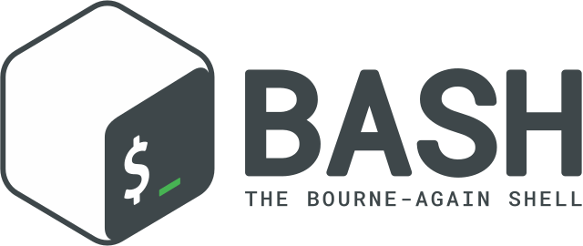

    <h1>Welcome</h1>
    

    
I'm a 3rd year software developer apprentice working on Web Applications.

    
My interests are: music, greek mythology, current affairs, hi-tech news, video games, reading, traveling and programming.

    
I was born and I'm living in 🇨🇭. I speak 🇫🇷 🇪🇸 🇮🇹 🇺🇸

    

 
 

    <h1>Stats</h1>
     
     
     

 
 

    <h1>Languages</h1>
    
    &nbsp;&nbsp;&nbsp;
    
    &nbsp;&nbsp;&nbsp;
    
    &nbsp;&nbsp;&nbsp;
    

 
 

    <h1>Frameworks</h1>
    
    &nbsp;&nbsp;&nbsp;&nbsp;
    
    &nbsp;&nbsp;&nbsp;&nbsp;
    
     
    
    &nbsp;&nbsp;&nbsp;&nbsp;
    
    &nbsp;&nbsp;&nbsp;&nbsp;
    

 
 

    <h1>Visual frameworks</h1>
    
    &nbsp;&nbsp;&nbsp;&nbsp;
    

 
 

    <h1>Database management systems</h1>
    
    &nbsp;&nbsp;&nbsp;&nbsp;
    
    &nbsp;&nbsp;&nbsp;&nbsp;
    
    &nbsp;&nbsp;&nbsp;&nbsp;
    

 
 

    <h1>Operating systems</h1>
    
    &nbsp;&nbsp;&nbsp;&nbsp;
    
    &nbsp;&nbsp;&nbsp;&nbsp;
    
    &nbsp;&nbsp;&nbsp;&nbsp;
    

 
 

<h1 align="center">Side projects</h1>

- RandoRacer (under construction)
- [Noobill](https://noobill.ch/)
- [RandoBlazer app](https://noobill.ch/RandoBlazer/)
- [Timux](https://github.com/netanonima/timux)
   
   

<h1 align="center">Links</h1>

- [LinkedIn](https://www.linkedin.com/in/flavio-bertolini/)
- [GitHub](https://github.com/netanonima)
